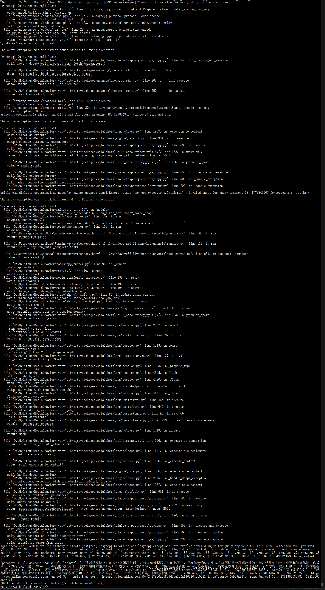
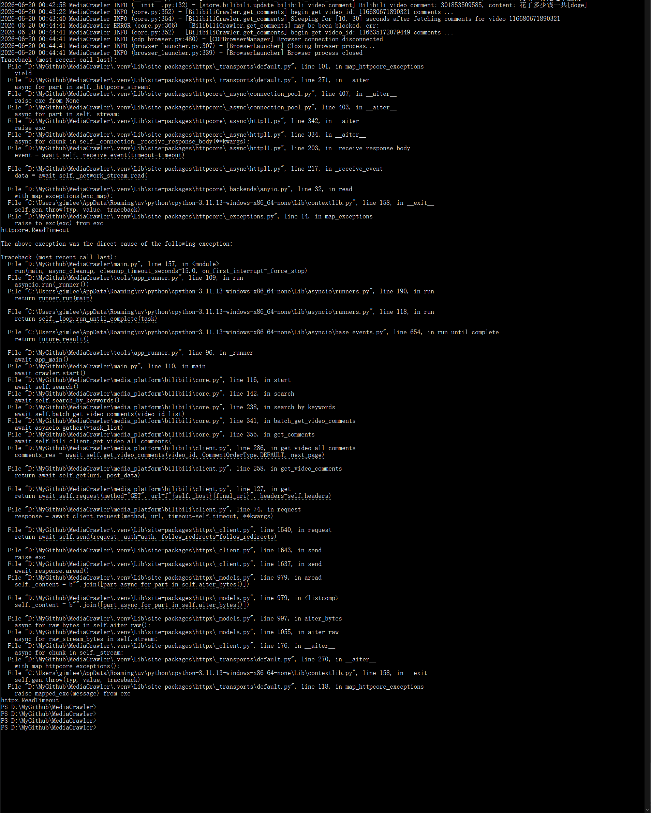
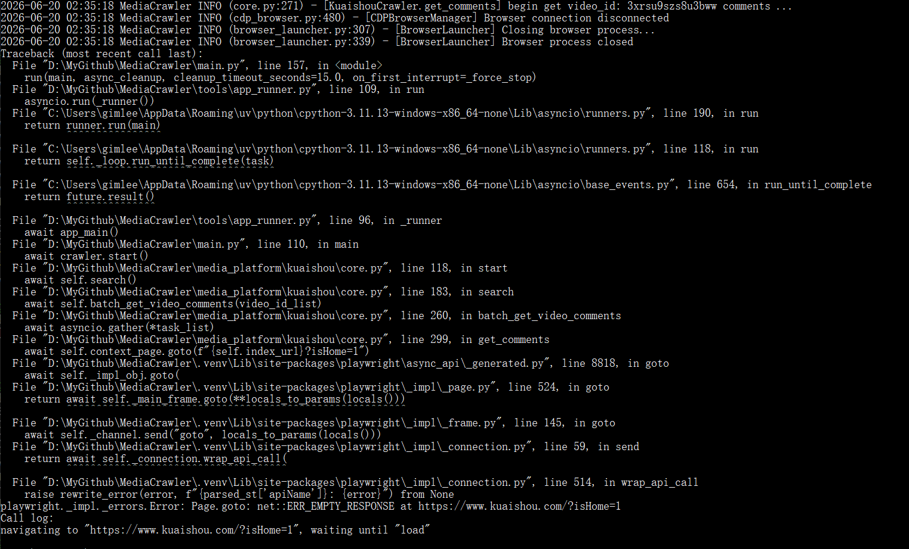

# 开发提示词

# P1
当前我在执行：
uv run main.py --platform xhs --lt qrcode --type search --save_data_option postgres
此时，我同时执行：
uv run main.py --platform zhihu --lt qrcode --type search --save_data_option postgres
就报错如下：

是不是一个程序执行的时候，进行锁库导致的。
应该只锁表就行了。


# P2
同一个关键字，我反复查询，怎么知道返回的结果有没有重复呢？
如果重复了，现在有办法去重，不写入DB吗？

# P3
1. 当前代码中不支持多个平台同时搜索，比如：
uv run main.py --platform dy --lt qrcode --type search
uv run main.py --platform ks --lt qrcode --type search
...
同时启动，对不同平台进行搜索。
请解决这种问题，可能是 CDP_DEBUG_PORT = 9222 这里配置单个端口导致。
具体问题你解决一下。至少要支持10个不同平台同时搜索。

2. 当前配置：CRAWLER_MAX_SLEEP_SEC = 10
这个停顿时间是固定10秒，请改成支持范围内的随机停顿时间，比如：
CRAWLER_MAX_SLEEP_SEC = [10, 30]
从10~30中随机选择一个数N，停顿N秒。

3. 另外，请确认，当前搜索知乎平台的时候，好像只爬取了问题(question_id)的第一个回答。（请确认）
要求至少爬取前10个（可配置）的回答，以及回答下的最多50个评论（可配置）
该配置只对知乎平台生效。


# P4
执行
uv run main.py --platform zhihu --lt qrcode --type search --save_data_option postgres
报错

# P5
当前获取知乎问题下多个回答的时候，你有进去问题页面，去获取多个回答吗？还是说只是获取到搜索的结果，默认只有一个回答，然后只是去尝试去或更多回答，不一定能够获取到？

# P6

修复该问题，网络超时不要中断程序。
当前的请求超时时间是多少？如果没有配置的地方，请增加配置，并默认设置45秒。
添加重试次数，默认3次（可以配置）
如果只是该条内容失败超过了3次，就跳过，记下失败次数。
如果失败次数（请求其他内容）超过10次(可以配置)，终止程序。


# P7
当前抓取内容的时候，有限制抓取某个key words的数量吗？
比如搜索 AI，返回几十万条结果和几百万条评论，难道会全部抓到写入DB吗？

# P8
那现在抓取的速度太慢是怎么回事呢？
请分析下，看哪里有优化空间，并且不能触发风控。

## AI回答：
建议的安全提速配置
批量搜索阶段建议先这样：
CRAWLER_MAX_NOTES_COUNT = 40
MAX_CONCURRENCY_NUM = 2
CRAWLER_MAX_SLEEP_SEC = [8, 18]
ENABLE_GET_COMMENTS = False
先只抓内容，不抓评论。筛出需要的内容后，再单独开评论抓取。
如果必须边搜边抓评论，建议：
CRAWLER_MAX_NOTES_COUNT = 30
MAX_CONCURRENCY_NUM = 2
CRAWLER_MAX_COMMENTS_COUNT_SINGLENOTES = 5
CRAWLER_MAX_SLEEP_SEC = [8, 18]
知乎建议先降：
ZHIHU_QUESTION_MAX_ANSWERS = 3
ZHIHU_MAX_COMMENTS_PER_CONTENT = 10
后续最大优化空间
最值得做的是把一个总 sleep 拆成分阶段配置：
CRAWLER_PAGE_SLEEP_SEC = [8, 18]
CRAWLER_DETAIL_SLEEP_SEC = [3, 8]
CRAWLER_COMMENT_SLEEP_SEC = [5, 12]
现在所有阶段都用 [10,30]，太粗。详情页和评论分页不一定需要和搜索翻页一样慢。拆开后可以保守提速，同时比单纯提高并发更不容易触发风控。

# P9
当前请求页面内容的时候，是把内容和评论一起请求得到了，还是分开请求的？

## AI回答：
分开请求的。
当前大多数平台流程是：
1. 搜索接口先拿内容列表  
   例如视频/帖子/回答的基础信息、ID、标题、作者、点赞数等。
2. 再按每条内容 ID 请求详情  
   有些平台搜索结果已经够完整，就直接入库；有些会再请求详情接口补全。
3. 再单独按内容 ID 请求评论  
   评论不是跟内容详情一起拿完的，而是后续调用评论接口分页抓取。

以 B 站为例：
- 搜索：`search_video_by_keyword()`
- 视频详情：`get_video_info()`
- 评论：`get_video_comments()` / `get_video_all_comments()`

以知乎为例：
- 搜索：`get_note_by_keyword()`
- 问题下更多回答：`get_question_answer_contents()`
- 评论：`get_root_comments()` / `get_note_all_comments()`
所以如果 `ENABLE_GET_COMMENTS = True`，抓取速度会明显变慢，因为每条内容后面还会追加评论请求和评论分页请求。

如果你只想先快速抓内容，可以设置：
```python
ENABLE_GET_COMMENTS = False
```
这样会跳过评论请求，速度会快很多。

# P10
MAX_CONCURRENCY_NUM = 2
这个并发控制是怎么进行并发的？是把key words拆成多个任务进行并发，还是怎么进行并发的？
还有就是这个并发是不是现在了抓取内容和评论？

# P11
不是很懂这个并发，当http去请求对方的内容的时候，你的关键字是一样，返回的内容也是一样，当多个并发请求时，看到的东西都是重复的，所以这里的并发的意义在哪里？
难道是把返回的结果进行了分段处理吗？可问题是慢在请求（限流），又不是处理时间。

## AI回答：
这里的并发不是多个任务拿同一个 keyword 去重复搜索。搜索请求本身基本是顺序的：
keyword=AI page=1 -> 返回 20 条内容 ID
并发发生在搜索结果已经返回之后。

比如搜索 AI 第 1 页返回：
视频 A
视频 B
视频 C
视频 D
...
后面每条内容还要单独请求详情或评论：
请求 A 的详情
请求 B 的详情
请求 C 的详情
请求 D 的详情
MAX_CONCURRENCY_NUM = 2 的意思是：
同时请求 A、B
A 或 B 完成后，再请求 C
再请求 D
...
所以并发的意义不是“重复请求同一个搜索页”，而是并发处理同一页返回的不同内容 ID。

# P12
请按照你的，建议的安全提速配置，进行优化：
CRAWLER_PAGE_SLEEP_SEC = [8, 18]
CRAWLER_DETAIL_SLEEP_SEC = [3, 8]
CRAWLER_COMMENT_SLEEP_SEC = [5, 12]
把一个总 sleep 拆成分阶段配置。


# P13
需要给各个平台爬取内容和评论等信息的时候，增加断点续爬功能。
请给出你的实现方案。

## AI回答：
我的实现建议是做成一个**平台无关的断点续爬层**，不要把逻辑散落到各个平台里。

**核心思路**
断点状态分两层记录：
1. **搜索/列表页进度**
   记录某个平台、某个关键词、某种爬取类型已经爬到第几页。
2. **单条内容进度**
   记录每条内容是否已经完成：
   - 内容详情是否已抓取
   - 评论是否已抓取
   - 评论抓到哪个 cursor / page / offset
   - 失败次数
这样即使程序在“第 5 页第 8 条内容的评论第 3 页”崩了，重启后也不会从头开始，也不会误跳过未完成内容。

**建议新增配置**
```python
ENABLE_RESUME = True

RESUME_STATE_BACKEND = "sqlite"
RESUME_STATE_DIR = "data/resume"

RESUME_RETRY_FAILED = True
RESUME_ITEM_MAX_FAILED_TIMES = 3

# 可选：手动指定一次任务 ID
RESUME_TASK_ID = ""
```

同时命令行增加：
```bash
--resume
--no_resume
--reset_resume
--resume_task_id xxx
```
默认行为建议是：同一个命令再次执行，自动续爬。
例如：
```bash
uv run main.py --platform zhihu --lt qrcode --type search --save_data_option postgres
```

再次执行同样命令时，自动从上次中断位置继续。
**状态存储方案**
我建议用一个独立的本地 SQLite 文件保存断点状态，即使实际内容写入 Postgres，也不要强绑定断点状态到业务库。

原因是：
- JSON / CSV / SQLite / Postgres 保存模式都能统一支持
- 多进程同时跑不同平台时，SQLite + WAL 可以保证原子更新
- 不污染业务数据表
- 后续也可以切换到 Postgres

新增类似：
```text
data/resume/
  zhihu_search_ai_xxx.sqlite
  xhs_search_ai_xxx.sqlite
```

**表结构设计**
页面进度表：
```sql
CREATE TABLE crawler_resume_pages (
    resume_key TEXT NOT NULL,
    platform TEXT NOT NULL,
    crawler_type TEXT NOT NULL,
    keyword TEXT NOT NULL,
    page INTEGER NOT NULL,
    cursor TEXT,
    status TEXT NOT NULL,
    fail_count INTEGER DEFAULT 0,
    updated_at INTEGER NOT NULL,
    PRIMARY KEY (resume_key, keyword, page)
);
```

内容进度表：
```sql
CREATE TABLE crawler_resume_items (
    resume_key TEXT NOT NULL,
    platform TEXT NOT NULL,
    keyword TEXT,
    content_id TEXT NOT NULL,
    content_type TEXT,
    detail_status TEXT DEFAULT 'pending',
    comment_status TEXT DEFAULT 'pending',
    comment_cursor TEXT,
    comment_done_count INTEGER DEFAULT 0,
    fail_count INTEGER DEFAULT 0,
    updated_at INTEGER NOT NULL,
    PRIMARY KEY (resume_key, platform, content_id)
);
```

`comment_cursor` 用 JSON 存，例如：
```json
{
  "page": 3,
  "cursor": "xxx",
  "offset": 20,
  "next_page": 4
}
```

不同平台字段不同，但统一塞进 JSON。
**执行流程**
搜索模式大概变成：

```text
for keyword in KEYWORDS:
    for page in pages:
        如果 page 已 done，跳过

        请求搜索页
        把返回的 content_id 写入 resume_items

        for content in contents:
            如果 detail_status = done，跳过详情
            否则抓详情 -> 写 DB -> 标记 detail done

            如果开启评论：
                如果 comment_status = done，跳过评论
                否则从 comment_cursor 继续抓评论
                每抓完一页评论，更新 comment_cursor
                全部完成后标记 comment done

        当前 page 下所有内容都完成后，标记 page done
```

注意这里有个关键点：**不能搜索页一请求成功就标记 page done**。  
必须等这一页的内容详情和评论都处理完，才能标记 page done，否则崩溃后容易漏抓评论。

**评论断点**
评论建议分两期做。
第一期先实现“内容级断点”：
- 内容 A 评论没抓完，重启后重新抓内容 A 的评论
- 依赖 DB 的唯一键 / upsert 去重
- 实现成本低，立刻能解决大部分中断重跑问题

第二期再实现“评论页级断点”：
- 每个平台评论接口保存自己的 cursor / page / offset
- 重启后从评论第 N 页继续
- 对长评论内容更高效
因为各平台评论分页方式不同，强行一次性做精确评论续爬，改动会比较大。
**去重配合**
断点续爬要和去重一起做。
DB 写入层应该保证：
- 内容表按 `platform + content_id` 唯一
- 评论表按 `platform + comment_id` 唯一
- 二级评论同理
- 写入使用 upsert 或 insert-ignore/update
这样即使某条内容因为崩溃被重新请求，也不会重复写入 DB。
**并发安全**
为了支持多个平台同时跑，断点层要做两件事：
1. 不同平台使用不同 `resume_key`
2. 同一个 `resume_key` 下的 item 处理要有状态锁
状态可以是：
```text
pending
running
done
failed
```
可选加：

```text
locked_until
```
避免同一个任务被两个进程同时处理。
**我建议的落地顺序**
1. 新增 `tools/resume_manager.py`
2. 新增断点配置和命令行参数
3. 先接入所有平台的 search 页级断点
4. 再接入内容详情级断点
5. 再接入评论内容级断点
6. 最后逐个平台补精确评论 cursor 续爬
第一版做到“页面 + 内容 + 评论任务级别”的续爬，就已经能解决大部分中断后从头爬的问题；第二版再优化到“评论分页级别”的精确续爬。


# P14
请按照你的方案，实现第一版做到“页面 + 内容 + 评论任务级别”的续爬

# P15
执行：uv run main.py --platform ks --lt qrcode --type search --save_data_option postgres
报错：

修复这个问题


# P16
CRAWLER_MAX_NOTES_COUNT = 50
这里如果我设置的非常大，但返回的结果没有这么多，现在是怎么处理?

# P17
为什么zhihu_content表中的content_text有大量空值？
是没有获取到数据吗？

## AI回答：
content_text 大量为空，通常表示当前流程只拿到了搜索摘要/列表数据，没有拿到正文全文。
不是 Postgres 没写进去，也不一定是请求失败。

如果你的目标是 zhihu_content.content_text 必须有正文，需要改成：搜索拿到 content_id 后，再进入详情页/API 补正文：
answer：调用 get_answer_info(question_id, answer_id)
article：调用 get_article_info(article_id)
zvideo：仍然可以保持空，或只存 desc
另外现在断点续爬里把搜索结果写入后会标记 detail_done，这个语义对知乎正文不够准确；如果要补正文，我建议把知乎 search 改成“搜索列表 -> 详情补全文 -> 入库 -> 标记 detail_done”。这样 content_text 才会更完整。

# P18
按照你的方案修改，同时修改断点续爬。
我的目标是必须要拿到回答结果。
还有就是你的增加断点续爬的命令，增加到说明文档中。我要重新开始爬取内容，并且更新现在content_text为空的内容。

# P19
我现在是：
uv run main.py --platform zhihu --lt qrcode --type search --save_data_option postgres --resume_task_id zhihu_refill_content_text_001 --reset_resume
这个命令启动任务的，我现在需要停止下，修改配置，然后再启动，但需要任务继续。
应该执行的命令是：
uv run main.py --platform zhihu --lt qrcode --type search --save_data_option postgres --resume_task_id zhihu_refill_content_text_001
这样？

# P20
MAX_CONCURRENCY_NUM = 3
这个并发配置，需要按照不同平台来进行配置，默认使用这个配置。
比如
ZHIHU_MAX_CONCURRENCY_NUM = 10
BILI_MAX_CONCURRENCY_NUM = 2
代表知乎、bilibili不同平台的最大并发数。

# P21
新增命令：补充知乎平台的空白内容。
当前知乎平台中，有大量的content_text中有大量的空白内容，可能是之前的bug导致，需要对该平台的空白内容再去请求一次。
uv run main.py --platform zhihu --lt qrcode --type fix_content --save_data_option postgres
该命令把content_text为空的内容，找到对应的URL，请求更新内容

# P22
现在系统了中参考其他的平台的实现方法，扩展实现 掘金(juejin) 平台的爬取功能。
你检查下代码，是否满足以下需求：
要求按照现有的代码结构进行扩展，支持现有的命令。支持数据落库。
如果发现什么问题、bug或者功能缺陷，请修改完善代码。

# P23
要求掘金接入现有 Web API/WebUI
补齐API 平台枚举和 WebUI


uv run main.py --platform dy --lt qrcode --type search --save_data_option postgres
uv run main.py --platform ks --lt qrcode --type search --save_data_option postgres
uv run main.py --platform tieba --lt qrcode --type search --save_data_option postgres
uv run main.py --platform wb --lt qrcode --type search --save_data_option postgres
uv run main.py --platform zhihu --lt qrcode --type search --save_data_option postgres
uv run main.py --platform bili --lt qrcode --type search --save_data_option postgres